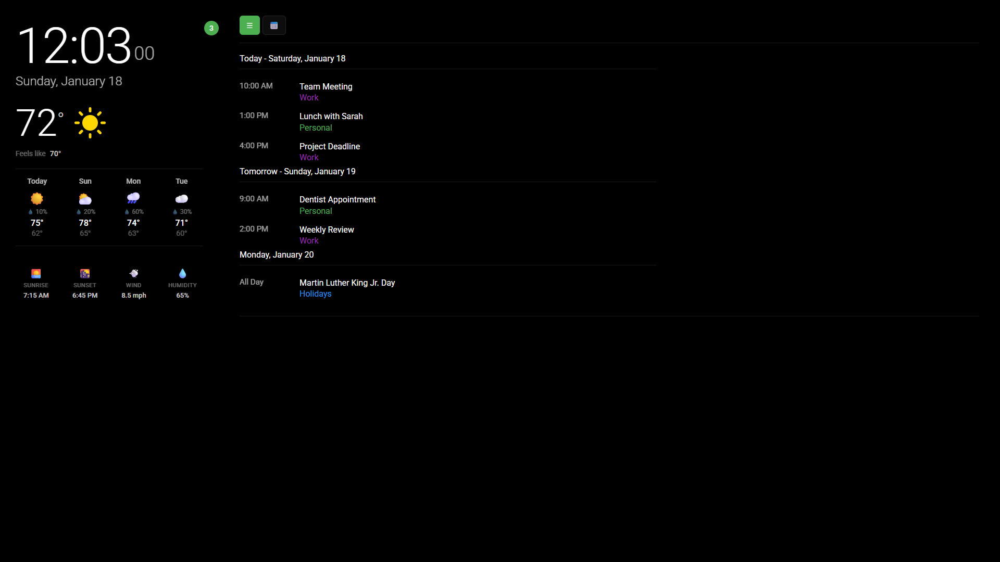

# Calboard

A beautiful calendar and weather dashboard designed for Raspberry Pi displays. Shows multiple linked calendars (ICS format) alongside current weather and forecasts in an easy-to-read dark theme interface.



## Features

- **Real-time Clock** - Large, easy-to-read time display with seconds
- **Weather Display** - Current temperature, conditions, and 4-day forecast
- **Multi-Calendar Support** - Display events from multiple ICS calendar sources
- **Color-coded Events** - Each calendar has its own color for easy identification
- **Auto-refresh** - Automatically updates weather and calendar data
- **Responsive Design** - Works on various screen sizes
- **Kiosk Mode** - Double-click to enter fullscreen mode with hidden cursor
- **Customizable** - Background images, time format, and more
- **Web Admin Interface** - Configure everything remotely via browser at `/admin`

## Requirements

- Node.js 16 or higher
- A free OpenWeatherMap API key
- ICS calendar URLs (Google Calendar, Outlook, iCloud, etc.)

## Quick Start

### 1. Clone the repository

```bash
git clone https://github.com/your-repo/calboard.git
cd calboard
```

### 2. Install dependencies

```bash
npm install
```

### 3. Configure the dashboard

Copy the example configuration file:

```bash
cp config.example.json config.json
```

Edit `config.json` with your settings:

```json
{
  "weather": {
    "apiKey": "YOUR_OPENWEATHERMAP_API_KEY",
    "latitude": 30.2672,
    "longitude": -97.7431,
    "units": "imperial"
  },
  "calendars": [
    {
      "name": "Personal",
      "url": "https://calendar.google.com/calendar/ical/your-calendar-id/basic.ics",
      "color": "#4CAF50"
    }
  ],
  "display": {
    "daysToShow": 7,
    "refreshIntervalMinutes": 5,
    "backgroundImage": "/backgrounds/leaf.jpg",
    "dateFormat": "en-US",
    "timeFormat": "12h"
  },
  "server": {
    "port": 3000
  },
  "admin": {
    "password": null
  }
}
```

**Tip:** You can also configure everything via the web interface at `/admin` after starting the server.

### 4. Start the server

```bash
npm start
```

### 5. Open in browser

Navigate to `http://localhost:3000` (or `http://<your-pi-ip>:3000` from another device)

## Configuration Options

### Weather

| Option | Description | Example |
|--------|-------------|---------|
| `apiKey` | Your OpenWeatherMap API key | `"abc123..."` |
| `latitude` | Location latitude | `30.2672` |
| `longitude` | Location longitude | `-97.7431` |
| `units` | Temperature units (`imperial` or `metric`) | `"imperial"` |

#### Getting an OpenWeatherMap API Key

1. Go to [OpenWeatherMap](https://openweathermap.org/api)
2. Sign up for a free account
3. Navigate to "API keys" in your account
4. Copy your API key to the config

### Calendars

Add multiple calendars with different colors:

```json
"calendars": [
  {
    "name": "Family",
    "url": "https://calendar.google.com/calendar/ical/.../basic.ics",
    "color": "#4CAF50"
  },
  {
    "name": "Work",
    "url": "https://outlook.office365.com/owa/calendar/.../calendar.ics",
    "color": "#9C27B0"
  },
  {
    "name": "US Holidays",
    "url": "https://calendar.google.com/calendar/ical/en.usa%23holiday%40group.v.calendar.google.com/public/basic.ics",
    "color": "#2196F3"
  }
]
```

#### Getting Calendar ICS URLs

**Google Calendar:**
1. Open Google Calendar settings
2. Click on the calendar you want to add
3. Scroll to "Integrate calendar"
4. Copy the "Secret address in iCal format"

**Outlook/Office 365:**
1. Go to Outlook Calendar on the web
2. Settings > View all Outlook settings
3. Calendar > Shared calendars
4. Publish a calendar and copy the ICS link

**Apple iCloud:**
1. Open Calendar app on Mac
2. Right-click on calendar > Share Calendar
3. Check "Public Calendar"
4. Copy the URL

### Display Options

| Option | Description | Default |
|--------|-------------|---------|
| `daysToShow` | Number of days to display | `7` |
| `refreshIntervalMinutes` | Data refresh interval | `5` |
| `backgroundImage` | Path to background image | `null` |
| `dateFormat` | Locale for date formatting | `"en-US"` |
| `timeFormat` | `"12h"` or `"24h"` | `"12h"` |

## Web Admin Interface

Calboard includes a web-based configuration interface for managing settings remotely.

### Accessing the Admin Panel

Navigate to `http://<your-pi-ip>:3000/admin` from any device on your network.

### Features

- **Weather Settings** - Configure API key, location coordinates, and units
- **Calendar Management** - Add, edit, or remove calendars with color pickers
- **Display Settings** - Adjust refresh intervals, date/time formats, and backgrounds
- **Test Connections** - Verify calendar URLs and weather API before saving
- **Password Protection** - Optional authentication to secure the admin panel

### Securing the Admin Panel

By default, the admin panel is accessible without a password. To add protection:

1. Go to the admin panel (`/admin`)
2. Scroll to "Admin Security"
3. Enter a password (minimum 8 characters) and save

The password will be automatically hashed with bcrypt for secure storage. Sessions last 24 hours and use secure HTTP-only cookies.

**Important:** Set a password immediately after initial setup to protect your configuration.

## Raspberry Pi Setup

### Auto-start on boot

1. Install the required packages:

```bash
sudo apt-get update
sudo apt-get install -y chromium-browser unclutter
```

2. Create a startup script:

```bash
nano ~/start-calboard.sh
```

Add the following:

```bash
#!/bin/bash

# Wait for network
sleep 10

# Start the server
cd /home/pi/calboard
node server.js &

# Wait for server to start
sleep 5

# Hide cursor and start browser in kiosk mode
unclutter -idle 0 &
chromium-browser --noerrdialogs --disable-infobars --kiosk http://localhost:3000
```

3. Make it executable:

```bash
chmod +x ~/start-calboard.sh
```

4. Add to autostart:

```bash
mkdir -p ~/.config/autostart
nano ~/.config/autostart/calboard.desktop
```

Add:

```ini
[Desktop Entry]
Type=Application
Name=Calboard
Exec=/home/pi/start-calboard.sh
```

### Disable screen blanking

```bash
sudo nano /etc/xdg/lxsession/LXDE-pi/autostart
```

Add these lines:

```
@xset s off
@xset -dpms
@xset s noblank
```

## Customization

### Background Images

Place images in the `public/backgrounds/` directory and reference them in the config:

```json
"backgroundImage": "/backgrounds/your-image.jpg"
```

Recommended: Use dark, low-contrast images that don't interfere with text readability.

### Custom Colors

Calendar colors can be any valid CSS color:
- Hex: `"#4CAF50"`
- RGB: `"rgb(76, 175, 80)"`
- Named: `"green"`

## Security

Calboard includes multiple security features to protect your dashboard.

### Built-in Security Features

| Feature | Description |
|---------|-------------|
| **Helmet.js** | Security headers (CSP, HSTS, X-Frame-Options, etc.) |
| **Rate Limiting** | Prevents brute force attacks (5 login attempts per 15 min) |
| **Bcrypt Hashing** | Passwords are hashed with bcrypt (12 rounds) |
| **Session Management** | Secure HTTP-only cookies with CSRF protection |
| **Input Validation** | All inputs are validated and sanitized |
| **Request Size Limits** | Body parsing limited to 100KB |

### Setting Up HTTPS (Recommended for Production)

For production use, especially if accessible over the internet, use HTTPS:

**Option 1: Reverse Proxy with Nginx**

```bash
sudo apt-get install nginx certbot python3-certbot-nginx
```

Create `/etc/nginx/sites-available/calboard`:

```nginx
server {
    listen 80;
    server_name your-domain.com;

    location / {
        proxy_pass http://localhost:3000;
        proxy_http_version 1.1;
        proxy_set_header Upgrade $http_upgrade;
        proxy_set_header Connection 'upgrade';
        proxy_set_header Host $host;
        proxy_set_header X-Real-IP $remote_addr;
        proxy_set_header X-Forwarded-For $proxy_add_x_forwarded_for;
        proxy_set_header X-Forwarded-Proto $scheme;
        proxy_cache_bypass $http_upgrade;
    }
}
```

Enable SSL:

```bash
sudo ln -s /etc/nginx/sites-available/calboard /etc/nginx/sites-enabled/
sudo certbot --nginx -d your-domain.com
```

**Option 2: Local Network Only**

If running on a local network only, ensure your router firewall blocks external access to the Pi's port.

### Password Requirements

- Minimum 8 characters
- Passwords are automatically migrated to bcrypt if set via plain text
- Session expires after 24 hours of inactivity

### Security Best Practices

1. **Set an admin password** - Protect the admin panel immediately after setup
2. **Use HTTPS** - Especially if accessing over the internet
3. **Keep Node.js updated** - Run `npm audit` periodically
4. **Restrict network access** - Use firewall rules to limit access to trusted devices
5. **Don't expose to internet** - If possible, keep the dashboard on your local network only

## Troubleshooting

### Weather not loading
- Verify your OpenWeatherMap API key is correct
- Check that your coordinates are valid
- New API keys may take a few hours to activate

### Calendar not loading
- Ensure the ICS URL is accessible (try opening it in a browser)
- For private calendars, use the "secret" URL, not the public one
- Check for CORS issues if using unusual calendar providers

### Display issues
- Refresh the browser (F5)
- Check the browser console for errors (F12)
- Verify the server is running (`npm start`)

## License

MIT License - see LICENSE file for details.

## Contributing

Contributions are welcome! Please feel free to submit a Pull Request.
